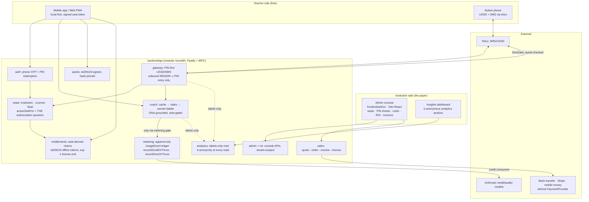

# SOMO Architecture

SOMO is an offline-first AI teaching coach for low-connectivity markets, sold as a seat-licensed B2B/B2G platform (see BUSINESS_MODEL.md). Every architectural decision follows from four constraints:

1. **No access without an authorized seat.** Every metered action — LLM call, outbound SMS, USSD-triggered work, pack download/sync — requires an ACTIVE seat on an ACTIVE license with remaining quota. Unknown state = **fail closed**: no paid call. This makes monthly spend ≤ `seats × quota × unit cost` by construction (ADR-0009).
2. **The connectivity ladder is the product.** Wi-Fi → 2G → SMS/USSD → fully offline. Every feature defines its behaviour at every rung, down to a button phone with no app.
3. **Money paths are financial software.** Invoicing, charge auditing, payouts: idempotent, double-entry where money is owed, replay-proof webhooks, raw bodies stored before processing.
4. **Offline is the default, not a degraded mode.** The device holds the teacher's work and a signed seat token; the server is the sync + authorization + AI brain.

## System overview



## The authorization spine (the pivot's core)

```
Institution 1─* License 1─* Seat *─1 User(teacher)
                   │
                   └─ per-seat monthly quotas (license defaults + overrides)
```

- **PINs**: each seat carries a one-time authorization PIN (confusable-free alphabet `ABCDEFGHJKMNPQRSTVWXYZ23456789`, HMAC-hashed at rest, plaintext shown exactly once on the printable PIN sheet). Redemption binds seat→teacher; revoke + reassign mints a fresh PIN and kills the old one.
- **One question everywhere**: `SeatService.activeSeatFor(userId | phone)` — seat ACTIVE, license ACTIVE, inside the term window, institution not suspended — evaluated lazily (no cron dependency). Null ⇒ every gate fails closed.
- **Entitlements are derived, never granted directly**: seated ⇒ `org_seat` claims with the license quotas and all standard packs; seatless ⇒ `none` with zero everything. Offline seat tokens (ed25519, compact base64url, SMS-transportable) expire at `min(now+30d, licenseEnd)` with a 7-day degraded grace — a lapsed license stops new AI even on a device that never reconnects.
- **Two cost gates, both audited**: `recordAiCallOrThrow` is the only path to an LLM; `SmsGate.recordSmsOrThrow` the only path to non-OTP outbound SMS. Refusals are recorded as `quota_block` events — the audit trail of money _not_ spent. Auth OTPs are the single deliberate pre-seat cost, bounded by the resend window.
- **Graceful degradation**: over-quota seats still receive cached coach answers (flagged `degraded`); reflections and Class DNA (no marginal cost) stay ungated.

## Monorepo layout

```
somo/
├─ frontend/
│  ├─ admin/         # institution console (the buyer's product) — Vite+React,
│  │                 # token-CSS design system, PIN sheets, cost/ROI dashboards
│  └─ mobile/        # teacher app (Expo/expo-router): PIN redemption, Ask Coach,
│                    # 3-Minute Mirror, Class DNA, offline seat-token verify + outbox
│  # web PWA and ussd-sim arrive next
├─ backend/
│  └─ api/           # modular monolith (ADR-0005): auth, seats, entitlements,
│                    # metering, coach, gateway, packs, admin, roi, sales,
│                    # analytics, billing plumbing, marketplace (dormant)
├─ packages/
│  ├─ types/         # zod contract — THE api boundary
│  ├─ packsign/      # canonical JSON + ed25519 (packs, seat tokens, invites)
│  ├─ payments/      # PaymentProvider: sandbox (full), Stripe, mobile-money slots
│  ├─ ui/            # design tokens (WCAG-gated), tailwind preset, Storybook
│  ├─ i18n/          # EN/FR/Hausa/Swahili
│  └─ config/        # shared tsconfig/eslint/prettier
├─ infra/            # docker-compose (pg+pgvector, redis, minio)
└─ docs/             # this file, BUSINESS_MODEL.md, DATA_GOVERNANCE.md, adr/
```

Modules inside `backend/api` are extraction-ready service classes (constructor-injected, no cross-imports of internals); they become separate deployables only when scale demands.

## Stack

| Layer    | Choice                                                                                                                                                                                   |
| -------- | ---------------------------------------------------------------------------------------------------------------------------------------------------------------------------------------- |
| Language | TypeScript everywhere; zod 4 contract in `packages/types`                                                                                                                                |
| API      | Node 22, Fastify 5, tRPC 11, Prisma 7 (+ pg adapter), PostgreSQL (+pgvector reserved)                                                                                                    |
| AI       | Anthropic behind an `AiProvider` adapter — cost ladder: cached (free) → `claude-haiku-4-5` → `claude-sonnet-5`; deterministic mock for tests/keyless dev                                 |
| Crypto   | ed25519 via `@somo/packsign` (packs, seat tokens); HMAC for PINs/OTPs                                                                                                                    |
| Payments | `PaymentProvider` interface: sandbox (fully functional, drives all money tests), Stripe (PaymentIntents + signature verify), mobile-money slots; bank-transfer invoices need no provider |
| Console  | Vite + React + TanStack Query + tRPC client; hand-rolled token CSS (82 kB gzipped), charts per the dataviz method (validated palette)                                                    |
| Tests    | Vitest 4; API integration suites run against **real Postgres** (embedded locally, service container in CI); the money/gating suites assert zero provider invocations                     |

## The connectivity ladder

| Tier     | Behaviour                                                                                                                                                                                                                                                                                                                                |
| -------- | ---------------------------------------------------------------------------------------------------------------------------------------------------------------------------------------------------------------------------------------------------------------------------------------------------------------------------------------- |
| Wi-Fi    | Full sync, pack downloads, AI coach, seat-token refresh                                                                                                                                                                                                                                                                                  |
| 2G       | Light batched sync; short-text coach answers                                                                                                                                                                                                                                                                                             |
| SMS/USSD | The button-phone product: PIN-first. Unbound MSISDNs get exactly one affordance (PIN entry); USSD replies ride the free session channel; unbound inbound SMS is silently dropped (a reply would be unauthorized spend). `ASK` pre-checks SMS quota before consuming an AI credit. Long USSD answers overflow to SMS only if quota allows |
| Offline  | Everything captured locally; signed seat token enforces limits with no connectivity; syncs later idempotently (client ULIDs)                                                                                                                                                                                                             |

## Money paths

- **B2B pipeline**: quote (tier pricing config) → order → invoice (sequential `INV-YYYY-NNNN`) → payment (`markPaid` with bank ref, or provider webhook) → **license provisioned only now**, with exactly the ordered seats. Every step idempotent.
- **Charge plumbing** (kept from v1, reused): audited `PaymentCharge` rows keyed by idempotencyKey + providerRef, raw webhook bodies stored before processing, replay-proof by event id, refunds idempotent via a dedicated `Refund` table.
- **Marketplace ledger** (dormant surface): double-entry journal, sum-zero per refId — ready for institutional content licensing.

## Analytics mart (separate product, separate rules)

Ingest classifies each coach question/reflection into a curriculum topic + skill (zero-cost keyword taxonomy) and stores **labels only** — no user id, phone, institution id, or transcript — with country, institution type, and ISO-week. Institutions can opt out (`analyticsOptOut`), enforced at the ingest gate. Every read applies k-anonymity (default K=5 distinct teachers per cell; suppressed cells are removed and the suppression disclosed). Full policy: `docs/DATA_GOVERNANCE.md`.

## Testing strategy

109 API integration tests + 60 package tests, all against real infrastructure (embedded Postgres locally — no Docker required — service containers in CI). The suites that define the product: `gating.test.ts` (zero LLM/SMS invocations when unauthorized/over-quota; provider-invocation count === `ai_call` ledger rows), `seats/admin/sales` (PIN lifecycle, tenancy, quote→license), `analytics` (PII stripping, k-suppression), `gateway` (PIN-first USSD/SMS). Every phase lands green (lint + typecheck + tests) before merge; ADRs 0001–0009 record the decisions.
