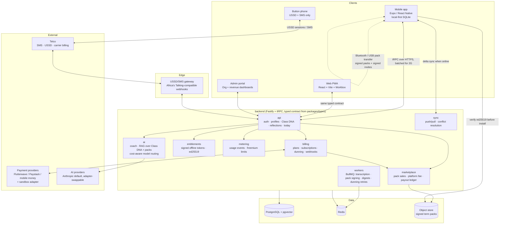

# SOMO Architecture

SOMO is an offline-first AI teaching coach for low-connectivity markets. Every architectural decision follows from four constraints:

1. **The connectivity ladder is the product.** Wi-Fi → 2G → SMS/USSD → fully offline. Every feature must define its behaviour at every rung, including on a button phone with no app at all.
2. **Revenue paths are financial software.** Billing, entitlements, and creator payouts must be correct, auditable, and idempotent — double-entry style ledgers, idempotency keys on every money mutation, replayable webhooks.
3. **Variable cost per user must stay tiny.** Small/cheap models with cost-aware routing, aggressive caching, SMS over data, peer-to-peer pack distribution.
4. **Offline is not a degraded mode — it is the default.** The device is the source of truth for the teacher's work; the server is the sync + money + AI brain.

## System overview



## Monorepo layout

pnpm workspace; frontend and backend communicate **only** through the typed contract (zod schemas + inferred types) in `packages/types`.

```
somo/
├─ frontend/
│  ├─ mobile/        # Expo (React Native) — the teacher app
│  ├─ web/           # React + Vite PWA, offline-first mirror of mobile
│  ├─ admin/         # Org portal + internal revenue dashboard
│  └─ ussd-sim/      # emulator for the button-phone USSD/SMS flow
├─ backend/
│  ├─ api/           # Fastify + tRPC main API (auth, DNA, reflections, today)
│  ├─ billing/       # plans, subscriptions, payments, webhooks, dunning
│  ├─ entitlements/  # access rights; signed offline entitlement tokens
│  ├─ metering/      # usage tracking for freemium limits + usage billing
│  ├─ marketplace/   # pack sales, creator payouts, revenue-share ledger
│  ├─ ussd-gateway/  # USSD/SMS webhook service
│  ├─ ai/            # AI coach; RAG over Class DNA + packs; provider adapter
│  ├─ sync/          # offline sync + conflict resolution engine
│  └─ workers/       # BullMQ queues: transcription, pack signing, digests, dunning
├─ packages/
│  ├─ ui/            # design system: tokens → primitives → composites; Storybook
│  ├─ types/         # shared zod schemas + TS types — THE api contract
│  ├─ i18n/          # EN / FR / Hausa / Swahili translations
│  ├─ payments/      # PaymentProvider interface + adapters (incl. sandbox)
│  └─ config/        # shared tsconfig / eslint / prettier / tailwind presets
├─ infra/            # docker-compose (pg+pgvector, redis, minio), seed scripts
├─ docs/             # this doc, BUSINESS_MODEL.md, API.md, adr/, runbook
└─ .github/workflows # CI: lint, typecheck, test, e2e, coverage gates
```

## Stack

| Layer        | Choice                                                                                           | Why                                                     |
| ------------ | ------------------------------------------------------------------------------------------------ | ------------------------------------------------------- |
| Language     | TypeScript everywhere                                                                            | one type system across the contract; shared zod schemas |
| Mobile       | Expo + Expo Router, React Query, Zustand, SQLite (local-first), NativeWind, react-native-ble-plx | boring, well-supported; local-first is mandatory        |
| Web/Admin    | React + Vite, PWA via Workbox, Tailwind                                                          | offline mirror with the same design system              |
| API          | Node 22, Fastify, tRPC, Prisma + PostgreSQL, pgvector                                            | typed end-to-end; pgvector avoids a separate vector DB  |
| Queues       | Redis + BullMQ                                                                                   | transcription, signing, digests, dunning retries        |
| Object store | S3-compatible (MinIO in dev)                                                                     | signed term packs                                       |
| Payments     | `PaymentProvider` interface → Flutterwave/Paystack/mobile-money adapters + full sandbox adapter  | tests run with zero real keys                           |
| AI           | Provider adapter, Anthropic default; small models + routing                                      | protect margins; on-device/cheap where quality allows   |
| Auth         | Phone + SMS OTP, JWT access + rotating refresh tokens                                            | no passwords; works with feature-phone identity         |
| Crypto       | ed25519 for pack signing and offline entitlement tokens                                          | verify on device before install/access; tiny signatures |

## The connectivity ladder

| Tier     | Transport       | Behaviour                                                                                                                |
| -------- | --------------- | ------------------------------------------------------------------------------------------------------------------------ |
| Wi-Fi    | HTTPS           | full sync, pack downloads, streaming AI, voice upload                                                                    |
| 2G       | HTTPS (batched) | light background sync: reflections + metering events in compressed batches; AI answers as short text; downloads deferred |
| SMS/USSD | telco gateway   | Ask Coach and reflections via USSD menus + SMS; no smartphone required                                                   |
| Offline  | none            | everything captured locally (SQLite outbox); entitlements verified via signed tokens; syncs when any rung above returns  |

The always-visible connectivity strip in the UI reflects the active tier; the sync engine chooses transport per payload class (money events and OTPs are never queued behind bulk media).

## Offline-first sync

- Every client mutation is an **event in a local outbox** with a client-generated ULID, then applied optimistically to local SQLite.
- Push: outbox drains oldest-first when connectivity allows; server applies idempotently (ULID = idempotency key).
- Pull: cursor-based deltas per collection.
- Conflict resolution: last-writer-wins on scalar profile fields; **append-only CRDT-style merge** for reflections, streaks, and metering events (they are facts, not states — never overwritten). Money mutations are server-authoritative only.

## Entitlements offline

The server issues short-lived **ed25519-signed entitlement tokens** (plan, limits, pack grants, expiry). The device verifies signatures locally and enforces freemium limits offline; tokens refresh opportunistically on any sync. Expiry gives a grace window (7 days) so a teacher without connectivity doesn't lose paid access mid-term. Metering events sync later and reconcile server-side counters.

## Signed term packs

Packs are content-addressed archives (lessons, prompts, media) signed with the SOMO ed25519 publisher key (marketplace creators get their own keys, countersigned by SOMO). Devices verify signatures **before install and before render** — this makes Bluetooth/USB peer distribution safe: a tampered pack fails verification regardless of how it arrived. Peer transfer embeds a signed referral invite (growth loop; see BUSINESS_MODEL.md).

## Money paths (billing, entitlements, payouts)

- **Idempotent**: every payment webhook and money mutation carries an idempotency key; replays are no-ops.
- **Auditable**: double-entry ledger tables for marketplace revenue share (sale → platform fee → creator balance → payout), append-only with immutable rows.
- **Reconcilable**: provider webhooks are stored raw before processing; a reconciliation worker compares provider state with local state.
- **Dunning**: failed renewals enter a retry schedule (day 0/2/5), SMS nudges, then downgrade to free — never data deletion.

## Testing strategy (summary — enforced in CI)

Unit (Vitest / RN Testing Library) → integration (supertest against real Postgres) → billing lifecycle suite on the sandbox adapter → contract tests (frontend types vs zod schemas) → offline/tier simulation → E2E (Playwright web+admin, Maestro mobile) → axe accessibility gates → analytics correctness (MRR/ARPU/churn/k-factor from seeded events). Coverage ≥ 80% on backend + shared packages. Every phase ends green before commit.

## Build phases

Phases 0–17 as agreed: scaffold → contract/ui/payments interface → api+auth → packs → entitlements+metering → billing → marketplace → AI coach → USSD/SMS → sync → mobile app (×2 phases) → admin → web PWA → a11y/i18n → E2E/perf → docs → v1.0.0 release hardening. One feature branch + PR + push per phase; ADR per major decision in `docs/adr/`.
